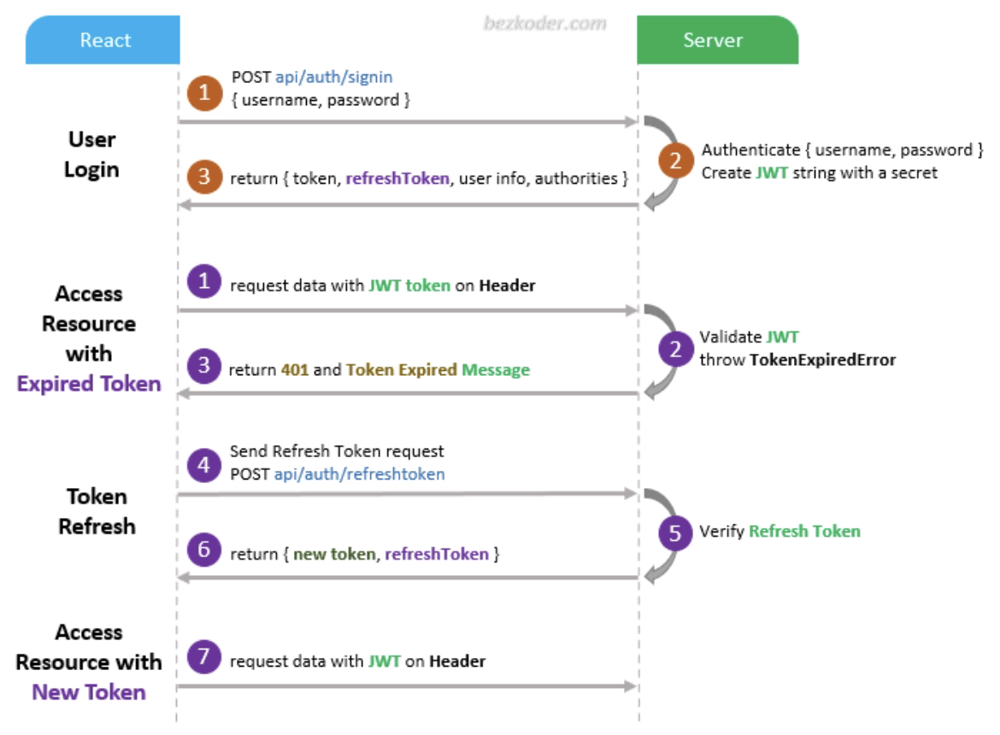
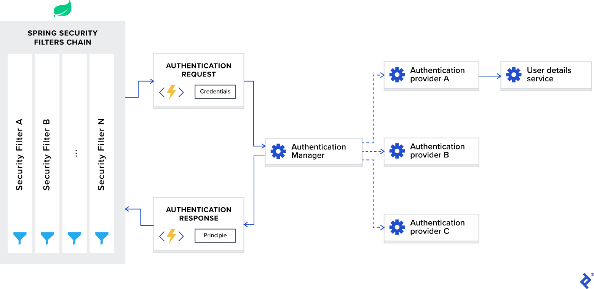

## AUTOPASS

Developed in part by Lam Nguyen, Raphael Paquin and Moncef Moutaki.

#### LINKS

- [Swagger-ui](http://localhost:9090/swagger-ui/index.html)
- [Swagger yaml](http://localhost:9090/v3/api-docs.yaml)
- [Swagger JSON](http://localhost:9090/v3/api-docs)
- [h2 Console](http://localhost:9090/h2-console)

---

#### H2 URL

> `jdbc:h2:file:./autopass.h2.db`

---

> To generate client code use maven lifecycle command `mvn verify` or `verify -f pom.xml`.

---

#### Accessing the app from another machine

1. Change the `application.properties` property `application.ip` to whatever the IP of the machine you will host on will be.
2. Run a `mvn verify`.
3. Access the page from `http://<YOUR_IP>:3000`.

#### For Google Oauth2 on other machines

---

If you plan on testing Oauth2 with Google on a separate machine you need to configure a few things.  

1. Go to the [Google console](https://console.cloud.google.com/apis/credentials/oauthclient/244388900912-q4r1gbp7mcp9e5bg76tvsjc28se5esco.apps.googleusercontent.com?project=autopass-414515) > Credentials and add the redirect url like so : `http://<YOUR_IP>.nip.io:9090/login/oauth2/code/google`
2. Add the Google account you'll be testing with in the google cloud console explicitly.

---

#### Setting Google service account as Google credential Environment variable

> The file to put in one of these commands is found in `AutoPass/AutoPass/src/main/resources/autopass-414515-f21ce763f523.json`.  
> More info on this can be found [here](https://cloud.google.com/docs/authentication/provide-credentials-adc#local-user-cred).

PowerShell
```shell
$env:GOOGLE_APPLICATION_CREDENTIALS="KEY_PATH"
```

Windows Terminal
```cmd
set GOOGLE_APPLICATION_CREDENTIALS=KEY_PATH
```

Macos Terminal || Linux
```zsh
export GOOGLE_APPLICATION_CREDENTIALS="PATH"
```

#### Stripe integration

For Stripe, we'll use fake credit cards as we are in testing mode. The list of these cards can be found [here](https://docs.stripe.com/testing).

#### Scanner App

The app responsible for scanning user cards is the directory named `autopass-scanner`. This is an extension to our backend and will only serve as a view component of our app, but built natively through react and `electronjs`.

> `> cd /autopass-scanner`

> `> npm run start`

> `> npm run electron start`


---





